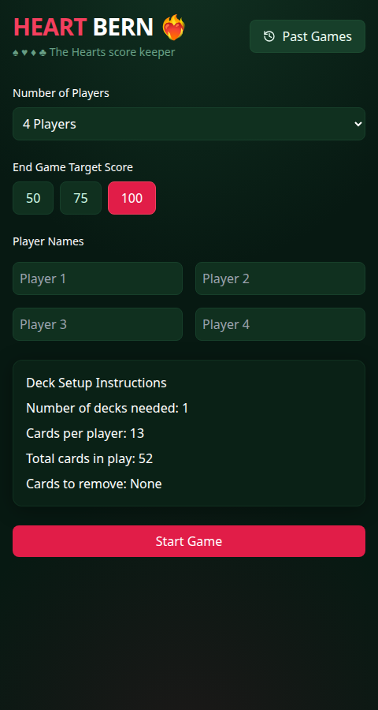
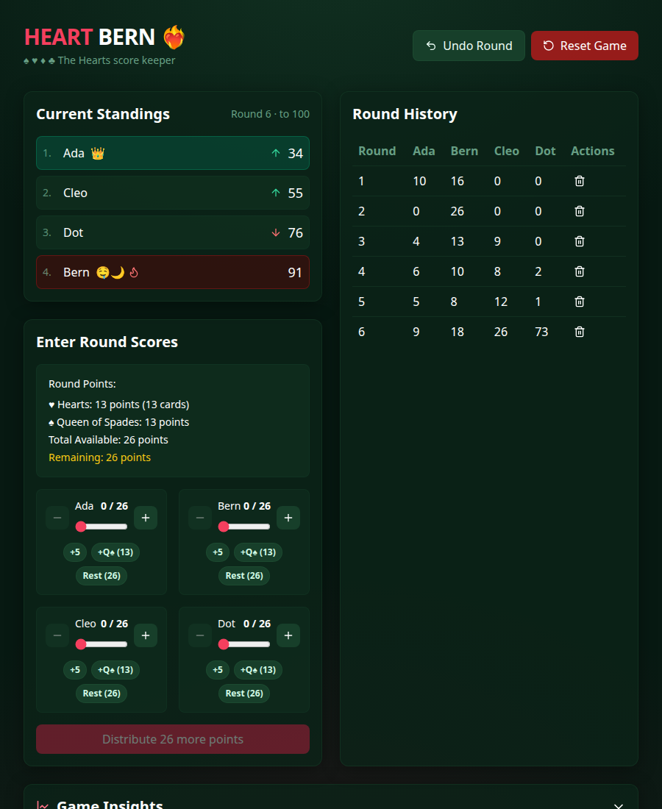
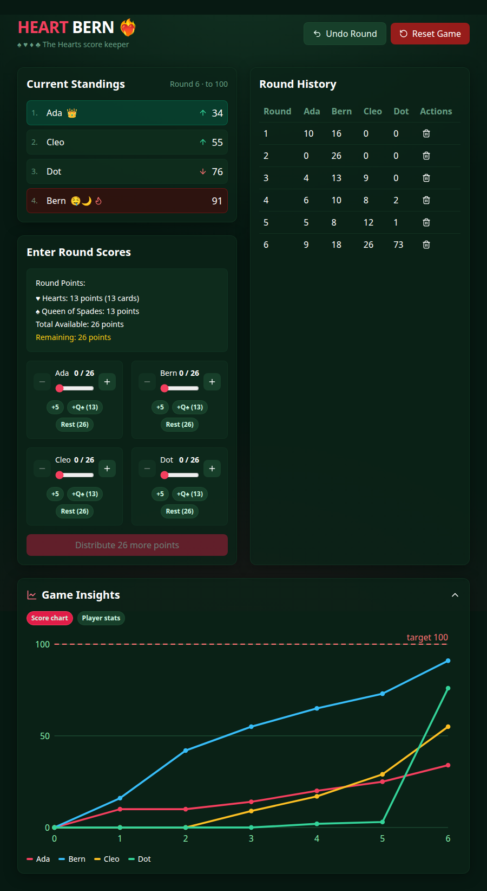

# HEART BERN ❤️‍🔥

A fast, friendly score keeper for the **Hearts** card game — built for phones at the card table. No accounts, no server: everything is saved on your device.

[Edit in StackBlitz next generation editor ⚡️](https://stackblitz.com/~/github.com/davestanyer/heartbern2)

| Setup | In game | Insights |
| --- | --- | --- |
|  |  |  |

## Features

- **3–12 players** with automatic deck setup: single or double deck, which cards to remove, and cards per player.
- **Slider score entry** with quick chips (+5, +Q♠, assign the rest) and point conservation — you can't submit until every point is accounted for.
- **Shoot the moon** handling: one tap gives the shooter 0 and everyone else the full round total, with a celebration to match.
- **Live standings** with animated reordering, movement arrows, and a danger-zone warning for players close to the target.
- **Game insights**: a score progression chart (with the target line) and per-player stats — average per round, worst round, clean rounds, Queen catches, and moon shots.
- **Undo last round** and per-round delete for quick corrections.
- **Past games & Hall of Fame**: finished games are archived on-device with win counts per player.
- **Share results** via the native share sheet (or clipboard) when the game ends.
- **Installable PWA**: add it to your home screen and it works offline.
- **Remembers your table**: player names and settings are pre-filled for the next game.

## Getting started

Requires Node 18+ (see `.nvmrc`).

```bash
npm install
npm run dev
```

## Scripts

| Command             | What it does                       |
| ------------------- | ---------------------------------- |
| `npm run dev`       | Start the Vite dev server          |
| `npm run build`     | Production build (with PWA assets) |
| `npm run preview`   | Preview the production build       |
| `npm test`          | Run the unit tests once            |
| `npm run test:watch`| Run tests in watch mode            |
| `npm run lint`      | ESLint                             |
| `npm run typecheck` | TypeScript project check           |

## How scoring works

Standard Hearts rules: each ♥ is worth 1 point, the Q♠ is worth 13, and the **lowest** total wins when any player reaches the target (50 / 75 / 100). Deck configurations for 3–12 players (including two-deck games, where only one Q♠ stays in play) live in [`src/utils/gameLogic.ts`](src/utils/gameLogic.ts).

## Tech

React 18 · TypeScript · Vite · Tailwind CSS · Framer Motion · Vitest · vite-plugin-pwa

All game data is stored in `localStorage` — there is no backend.
